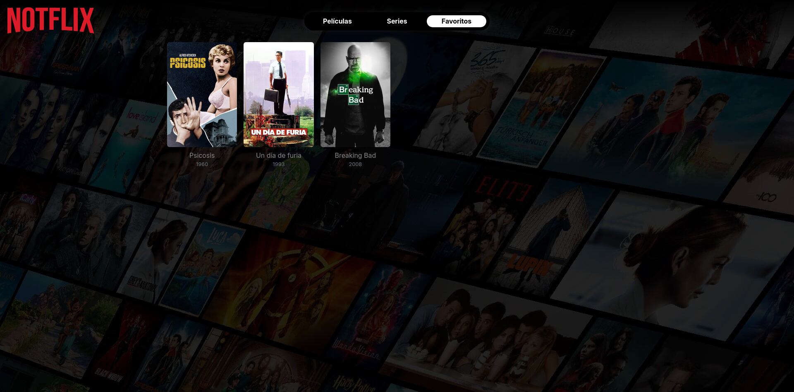

# NOTFLIX - Proyecto Angular Seminario 2025

## Tema
Aplicación web estilo Netflix que permite a los usuarios explorar series y películas, y gestionar una lista de favoritos. Cada favorito puede tener una puntuación y una reseña personal, tanto para series como para películas. La interfaz mantiene un diseño visual inspirado en Netflix para una experiencia familiar y atractiva.

---

## Datos del Estudiante
- **Nombre y Apellido:** Darío José Carsaniga
- **DNI:** 43.798.858
- **Email:** piexa.vu4r7@aleeas.com
- **Sede:** Rauch

---

## Librerías adicionales utilizadas
- Font Awesome (Iconos)
- Bootstrap (Estilos y diseño responsivo)
- ngx-infinite-scroll (Scroll infinito para listas de contenido)

---

## Capturas

  
*Pantalla principal mostrando películas*

  
*Pantalla de detalle de la película*

  
*Pantalla de detalle de la serie*

  
*Pantalla de detalle de la temporada*

  
*Lista de favoritos*

  
*Formulario PopUp para añadir favoritos*

---

## Proyecto en StackBlitz
[Ver proyecto en StackBlitz](https://stackblitz.com/github/Dario213987/notflix)
